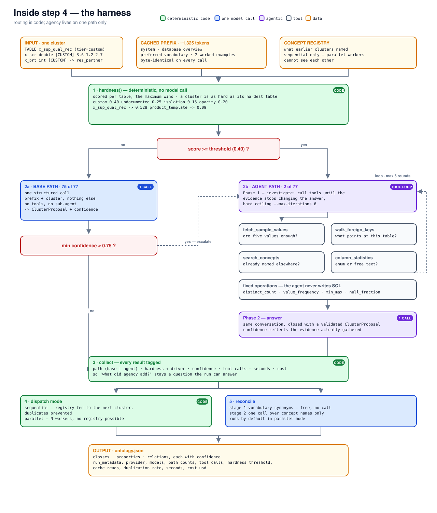

# The agentic system

Most of a schema does not need an agent. On the 418-table Odoo, **75 of 77 clusters** go through
the base system: one call, the cached prefix and the cluster, no tools. Measured against the agent
path on schemas whose names carry meaning, the two scored **identically** — so investigation there
buys nothing but tokens.

The agentic system exists for the other kind of table: the one called `x_sup_qual_rec` with columns
called `x_prt` and `x_scr`, that nobody documented and no model has memorised. There, the name
tells you nothing and the answer is in the data.

## When it runs

Two ways in, and the routing decision is **code, never a model judgement**:

**By hardness.** `hardness()` scores each cluster as its hardest table, from four signals:

| Signal | Weight | |
|---|---|---|
| `custom` | 0.40 | the customer built this table or these fields — nothing to retrieve |
| `undocumented` | 0.25 | the ERP has no description for it |
| `isolation` | 0.15 | few foreign keys, so it must be read from its values |
| `opacity` | 0.20 | short, vowel-less identifiers (`x_nc_cnt`) |

Threshold **0.40**, compared with `>=`. It equals the `custom` weight on purpose, so a fully
customer-built table reaches the agent on that signal alone — by construction, not by tuning.

**By escalation.** A base-system answer whose weakest class confidence falls below **0.75** is
re-run on the agent path. Hardness is a prior; the model's own doubt is evidence, and evidence may
overrule a prior.

Routing costs one call. Escalation costs two — which is why the custom-table rule exists at all,
since those clusters would escalate almost every time.

## What it does

Two phases, deliberately separate.

**Phase 1 — investigate.** The model is given the cluster and the four tools, and told to call them
only where an answer would change its mapping. It loops until it stops asking, or until
`--max-iterations` (default **6**). An agent that will not stop investigating is a cost incident,
so the cap is not optional.

**Phase 2 — answer.** The same conversation, closed with a validated `ClusterProposal`.

They are separate because mixing structured output into a tool loop behaves differently on every
provider, while *investigate, then answer* behaves the same everywhere and reads back cleanly
afterwards.

## The four tools

| Tool | Arguments | What it settles |
|---|---|---|
| `fetch_sample_values` | table, column, limit ≤ 40 | are five values enough? Masked as the run was configured. |
| `walk_foreign_keys` | table | what points **at** this table, beyond its cluster — up to 25 neighbours |
| `search_concepts` | query | has this concept already been named in this run? |
| `column_statistics` | table, column, operation | status code or free text? |

`column_statistics` takes an operation from a fixed set — `distinct_count`, `value_frequency`,
`min_max`, `null_fraction` — and **nothing else**.

### The agent cannot write SQL

That is the point of the enum. The agent picks a table, a column and an operation; this codebase
writes the statement. An agent composing SQL against a production ERP is a different risk
conversation entirely, and these four aggregates answer the questions that actually decide a
mapping without opening it.

It is enforced in code, not asked for in the prompt.

Every call is recorded in a `ToolLog`, written beside the ontology as `*.tools.json`, so what the
agent looked at can be read back after the fact.

### Without a database

`--db-url` is optional. Without it the agent still runs — `walk_foreign_keys` and
`search_concepts` work from the snapshot — but the two data tools fall back to the handful of
sample values ingestion captured. That is a materially weaker agent, and the run says so.

## What it is worth

Measured on RODI's `conference_renamed`, with all 66 tables and 125 columns **physically renamed**
in Postgres to `t_017cfe` / `c_5726c9` — the real database, 12,508 real rows behind meaningless
names. Same model on both sides; only tools and database access differ.

| | Class (exact) | Gold tables mapped | Tool calls | Tokens |
|---|---|---|---|---|
| Base system, no tools | 3/16 = 19% | **10 / 16** | 0 | 144k |
| Agent, tools on live data | 5/16 = 31% | **16 / 16** | 298 | 286k |

The coverage difference matters more than the accuracy one: **the base system silently produced
nothing at all for six of the sixteen gold tables.** Not wrong answers — no answers. The agent
mapped every one.

**A win only data access explains:** `passive_conference_partics` → `PassiveConferenceParticipant`,
from a table called `t_…` whose meaning was visible only in its rows and keys.

**A loss only data access explains:** `conference_fees` → `PostalCodePrefix`. The agent queried the
column, saw short numeric codes, and concluded postcodes. More evidence is not automatically better
evidence.

Roughly double the tokens for roughly double the coverage — and nothing at all where names already
carry meaning. That asymmetry is the whole argument for routing rather than always using one or the
other.

## After it runs

Two independent runs disagreeing is what flags a mapping for review — but most disagreements are
wording, not meaning. `mise run judge` asks about each one and drops the ones that are merely
worded differently, which is the difference between a review queue of 59% of your mappings and one
of roughly 2%.

## Files

| | |
|---|---|
| `mapping/hardness.py` | the router — pure code, no model |
| `mapping/llm/agent.py` | the two phases |
| `mapping/llm/tools.py` | the four tools and the audit log |
| `mapping/llm/base_llm.py` | what it is being compared against |
| `llm/prompts.py` | `AGENT_BRIEF` and `AGENT_ANSWER` |

## Open

- **`--max-iterations 6` is a guess.** The one real agent run used 298 tool calls across its
  clusters, but nothing has tested what happens at the ceiling.
- **Tool choice is unmeasured.** Nobody has checked which of the four earn their place, or whether
  a fifth would help.
